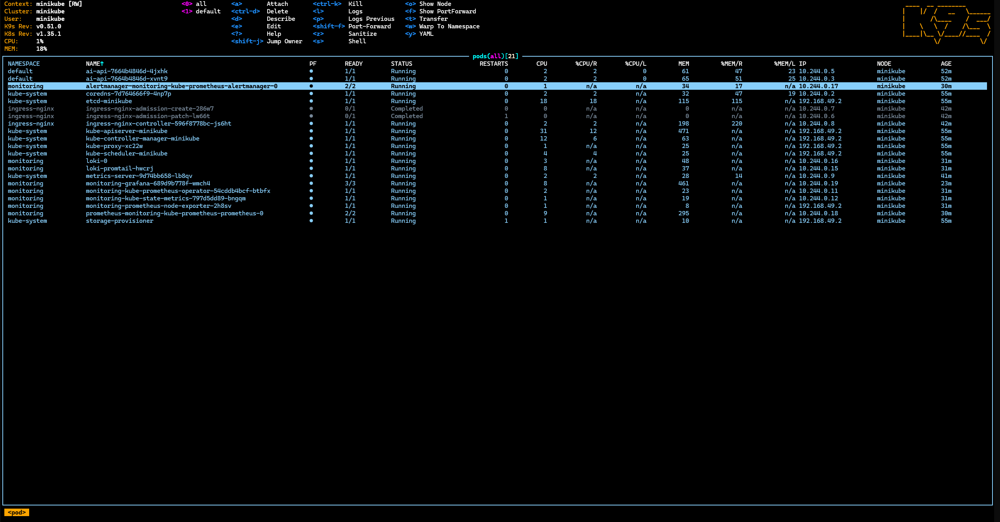
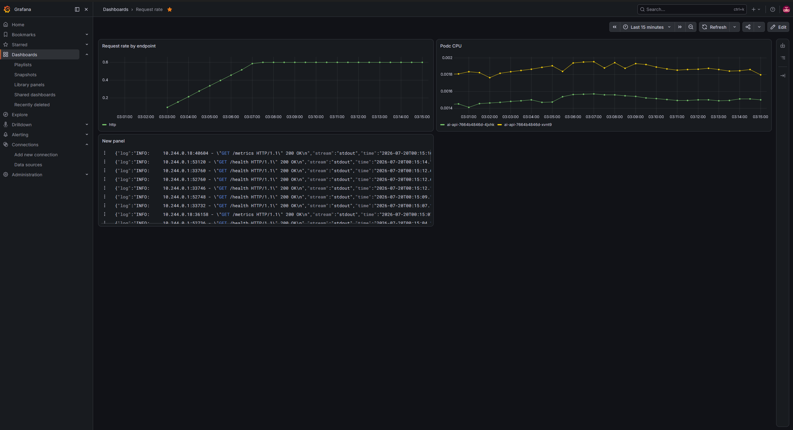

# ai-api-k8s-cicd

A production style DevOps pipeline built end to end on a local machine: a FastAPI service that answers questions through the Google Gemini API, containerized with Docker, deployed to Kubernetes with health probes, autoscaling and ingress, observed with Prometheus, Grafana and Loki, and delivered by a Jenkins pipeline. The application is deliberately small. The infrastructure around it is the project.

## Architecture

```
                 CI/CD
  GitHub ----> Jenkins ----> Docker Hub
                  |               |
                  | kubectl       | image pull
                  v               v
             +---------------------------+
             |    Kubernetes (minikube)  |
             |                           |
  client --> | ingress -> service -> pods (2 to 5, HPA)  |
             |             ConfigMap + Secret -> env     |
             +---------------------------+
                  |                |
        metrics   |                | logs (stdout)
                  v                v
             Prometheus         Promtail
                  \                |
                   \               v
                    +--> Grafana <-- Loki
```

## How secrets are handled

The Gemini API key never appears in code, in the image or in git. Locally it is injected as an environment variable through a Kubernetes Secret created imperatively:

    kubectl create secret generic gemini-secret --from-literal=GEMINI_API_KEY=<real-key>

The repo contains only `k8s/secret.yaml.example` with a placeholder. Kubernetes Secrets are base64 encoded, not encrypted, so the real protections are RBAC and keeping secret values out of version control.

Production upgrade path on Azure: store the key in Azure Key Vault and mount it with the Secrets Store CSI driver using a managed identity on AKS, so no secret value is ever stored in the cluster or the pipeline.

## How scaling works

A HorizontalPodAutoscaler watches average pod CPU against the request value (100m) and scales the deployment between 2 and 5 replicas at 70 percent utilization, backed by metrics-server. Scale down waits out a 5 minute stabilization window to avoid flapping. See `loadtest/loadtest.md` for a scripted demo.

On AKS the same HPA manifest works unchanged, and the cluster autoscaler adds node pool scaling underneath it, so both pods and nodes grow with load.

## Taking this to the cloud (AKS)

- `az aks create` provisions the managed cluster, replacing minikube
- Azure Container Registry replaces Docker Hub, images built with `az acr build`
- Application Gateway Ingress Controller or the same nginx ingress replaces the minikube ingress addon
- Azure Key Vault plus the Secrets Store CSI driver replaces the imperative secret
- Azure Monitor and Container Insights complement or replace the in cluster stack

The manifests stay about 95 percent unchanged because Kubernetes is the portability layer. The same repo deploys to AKS, EKS or GKE with configuration level changes only.

## Quickstart

Prerequisites: Docker Desktop, minikube, kubectl, helm.

    git clone https://github.com/KhaledWael3/ai-api-k8s-cicd.git
    cd ai-api-k8s-cicd

    docker build -t khaledwael/ai-api:latest .
    docker push khaledwael/ai-api:latest

    minikube start --driver=docker
    minikube addons enable ingress
    minikube addons enable metrics-server

    kubectl apply -f k8s/configmap.yaml
    kubectl create secret generic gemini-secret --from-literal=GEMINI_API_KEY=<real-key>
    kubectl apply -f k8s/deployment.yaml -f k8s/service.yaml -f k8s/ingress.yaml -f k8s/hpa.yaml

    helm repo add prometheus-community https://prometheus-community.github.io/helm-charts
    helm repo add grafana https://grafana.github.io/helm-charts
    helm repo update
    helm install monitoring prometheus-community/kube-prometheus-stack --namespace monitoring --create-namespace
    helm install loki grafana/loki-stack --namespace monitoring --set promtail.enabled=true --set grafana.enabled=false --set loki.isDefault=false
    kubectl apply -f monitoring/servicemonitor.yaml

Map the hostname (Windows, admin shell) and open the tunnel:

    Add-Content -Path C:\Windows\System32\drivers\etc\hosts -Value "127.0.0.1 ai-api.local"
    minikube tunnel

Test:

    Invoke-RestMethod http://ai-api.local/health
    Invoke-RestMethod -Method Post -Uri http://ai-api.local/ask -ContentType "application/json" -Body '{"question":"What is Kubernetes in one sentence?"}'

## Observability

Prometheus scrapes the app through a ServiceMonitor labeled `release: monitoring` so the operator picks it up. The app exposes `http_requests_total` (counter by endpoint and status) and `request_latency_seconds` (histogram). Promtail ships pod stdout to Loki. Grafana shows request rate, pod CPU and memory, and live logs in one dashboard, exported at `monitoring/grafana-dashboard.json`. LogQL examples live in `monitoring/loki-notes.md`. Loki was chosen over an ELK stack because it indexes labels instead of full text, which keeps it light enough for a laptop cluster while staying Grafana native.

## CI/CD

`Jenkinsfile` defines a declarative pipeline: checkout, pytest, docker build tagged with the build number, push to Docker Hub with credentials from the Jenkins store, then `kubectl set image` for a zero downtime rolling update. Unique image tags make deployments auditable and rollback trivial.

## Screenshots




